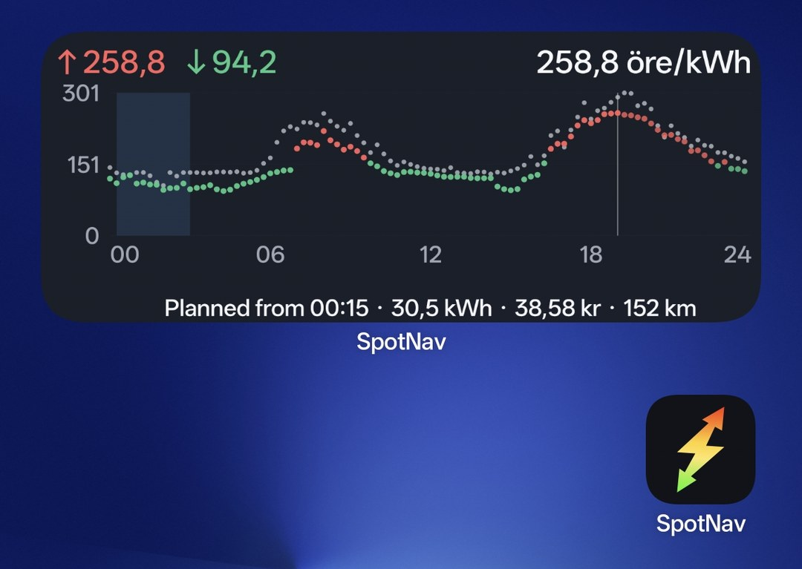
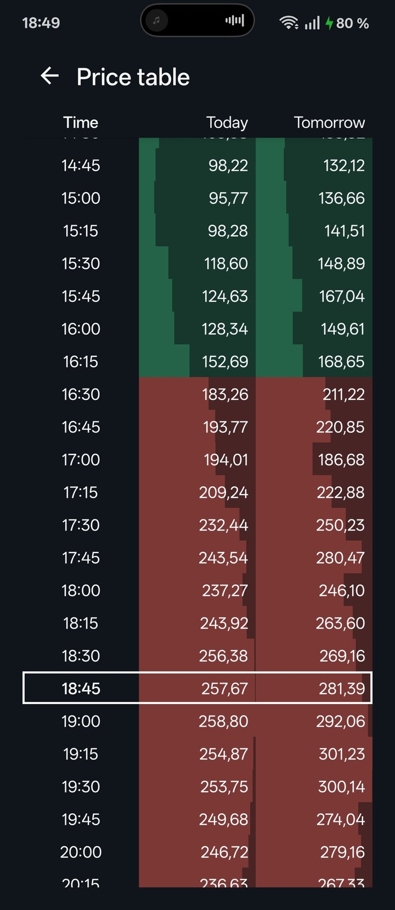
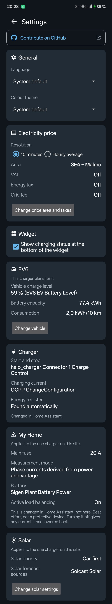
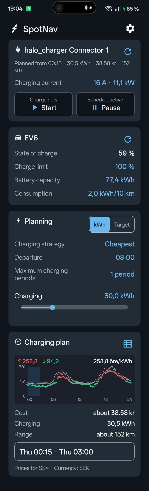

<p align="center">
  
</p>

SpotNav is an Android home-screen widget and EV charging planner. It shows today's and tomorrow's electricity spot prices on one 24-hour chart, finds the cheapest charging periods and can control a charger through Home Assistant. It covers the European day-ahead price areas the SpotNav relay publishes, and is available in English, Swedish, Norwegian, Danish and Finnish.

<p align="center">
  
</p>

## Features

- Today and tomorrow overlaid on one chart, with the current interval, minimum, maximum and current price highlighted.
- 15-minute prices or hourly averages, in local currency (SEK, NOK, DKK, EUR).
- Optional VAT, electricity tax and grid fee.
- Colour-coded price table.
- EV charging planner: charging current, phases, energy, vehicle consumption, departure time and up to eight charging periods, with the chosen periods shaded in the widget.
- Optional charging control through Home Assistant.
- Resizable widget, local cache for network failures and automatic checks for tomorrow's prices.

<p align="center">
  
  &nbsp;&nbsp;
  
</p>

## Get it

1. Install SpotNav from [Google Play](https://play.google.com/store/apps/details?id=se.sensnology.spotnav), or download the APK from [Releases](../../releases).
2. Install it and add **SpotNav** from the Android widget picker.
3. Choose language, price area, resolution and any taxes or fees. Tap the widget to open the price table and the EV planner.

## EV charging planner

Choose single-phase or three-phase charging (6–16 A), consumption, energy to add, up to eight charging periods and optionally a departure time. The app picks the cheapest combination of quarter-hours and shows cost and range.

If the charging window runs past the published prices, the missing intervals are estimated from the latest published day's prices at the same time of day, and the plan is marked as estimated. Calculations assume ideal power at 230 V single phase or 400 V three phase; charging losses and the vehicle's charging curve are not included.

<p align="center">
  
</p>

## Home Assistant pairing

With the [SpotNav integration](https://github.com/henrikekblad/spotnav-home-assistant) Home Assistant plans and runs the charging schedule itself, so it does not depend on the phone staying online.

1. Install the integration through HACS and pick your charger during setup.
2. In SpotNav, open **Settings → Home Assistant** and tap **Find Home Assistant on the network** (or type its address).
3. The app shows a code. Enter it in Home Assistant to approve the phone; every charger on that instance is paired at once.

The app receives one secret webhook ID per charger, never a Home Assistant password or token. HTTPS is required for internet addresses; local addresses may use HTTP. Details, entities and configuration are in the [integration repository](https://github.com/henrikekblad/spotnav-home-assistant).

## Prices

Prices come from the SpotNav relay ([spotnav.sensnology.se](https://spotnav.sensnology.se)), which publishes ENTSO-E day-ahead prices and converts currencies with ECB exchange rates. The price is a spot price without VAT, tax or grid fee. Enabled additions are applied as:

```text
(spot price × 100 + electricity tax + grid fee) × VAT
```

Suggested tax values are editable. Grid fees depend on provider and agreement, and fixed monthly charges are not included; check the values against your contract.

## Build locally

Requires JDK 17 and Android SDK 36.

```bash
./gradlew assembleDebug
```

The APK is written to `app/build/outputs/apk/debug/`. See [PRIVACY.md](PRIVACY.md) for what the app stores and sends.

## Disclaimer

SpotNav is not affiliated with ENTSO-E, the ECB, Nord Pool, electricity retailers or grid operators. Prices and charging calculations are guidance only; always verify them against your agreement and invoice.

## License

[MIT License](LICENSE).
