# SpotNav for Android

A tour of the app's screens. The pictures are taken by `tools/app_screenshots/run.sh` against a demo
Home Assistant with made-up devices (an OCPP charger, two Kia cars called "Family car" and "City car", a camera
whose picture is drawn, a site called "Home") and recorded relay prices, so names and numbers are examples.

## Without Home Assistant

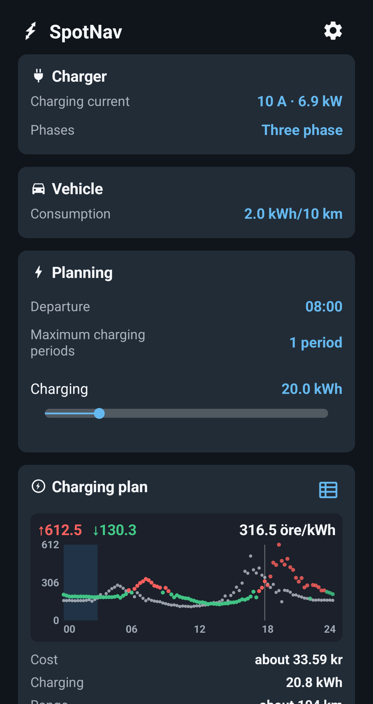

Before anything is paired, the app plans on its own: choose charging current and phases, the car's
consumption, a departure time, how many charging periods may be used and how much energy to add. The
plan picks the cheapest quarter-hours before departure and shows them shaded on the price chart, with
cost and range.

## Pairing with Home Assistant

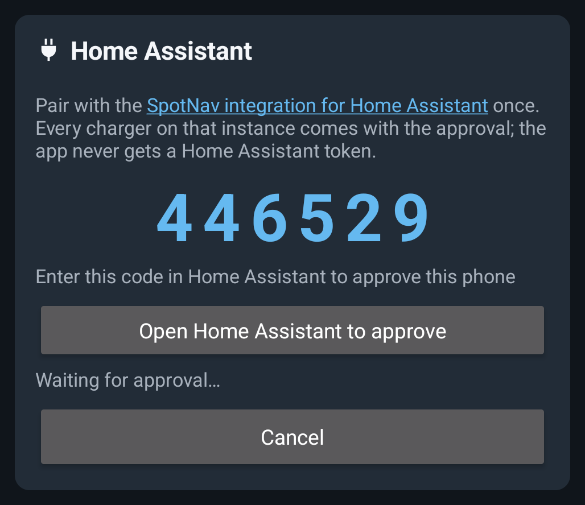

In **Settings → Home Assistant**, tap **Find Home Assistant on the network** (or type its address when
nothing answers). The app shows a six-digit code; Home Assistant shows the same code in **Settings →
Devices & services** and asks you to approve the phone. Every charger on that instance is paired at
once. The app gets one webhook ID per charger, never a Home Assistant password or token.

## Main screen

&nbsp;
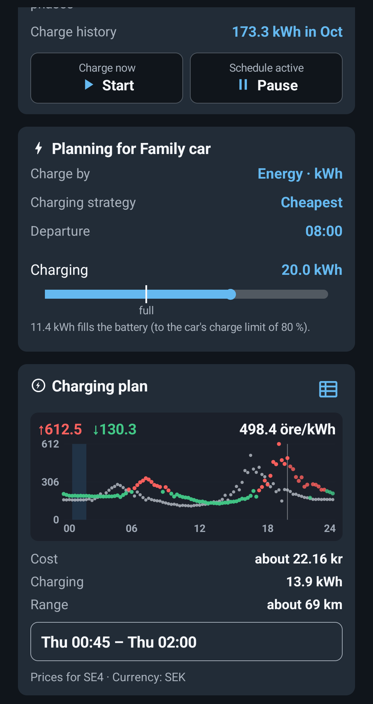

With Home Assistant paired, the main screen is the charger as Home Assistant runs it:

- **Charger**: what is happening and why, the connection, charging current and phases, this month's
  charged energy (tap it for the history), and **Charge now** / **Pause** for the schedule.
- **Vehicle**: charge level, charge limit, battery capacity, consumption and onboard charger, as the
  car reports them or as you set them.
- **Planning**: the strategy, departure, number of charging periods, and the energy to add (kWh) or a
  target charge level. The slider marks where the battery is full.
- **Charging plan**: the plan Home Assistant has installed.

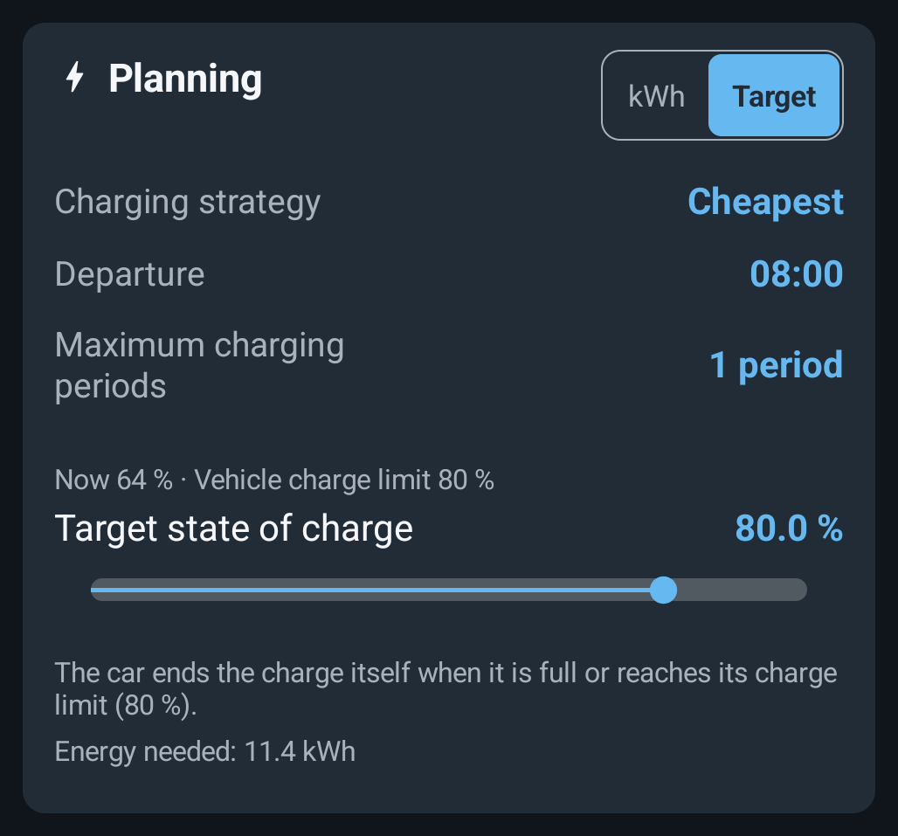

With **Target** instead of **kWh**, you set the charge level to reach; the app works out the energy from
the car's charge level and battery.

## Which car is plugged in?

When more than one car can charge at a charger, Home Assistant finds out which one was plugged in, from what
the cars report and, if you set one up, the charger's camera. The app shows the same as the Home Assistant card:

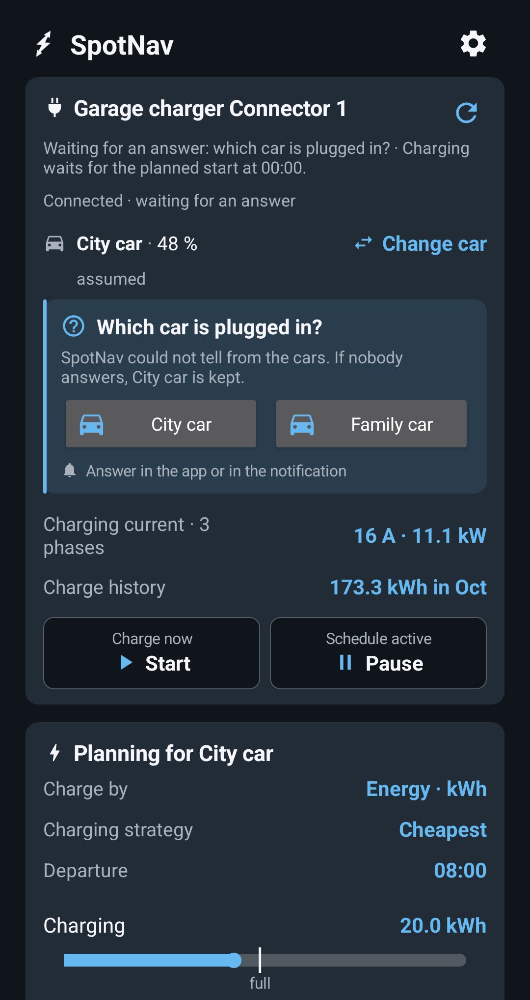

- **The question.** When Home Assistant cannot tell, the charger card shows **Which car is plugged in?** with one
  button per car, the likeliest first. The first answer wins, from the app, the card or the notification on any
  phone. If nobody answers, the car that was chosen stays.
- **The notification.** With the app's own notifications on (Settings → Notifications → via the SpotNav app), the
  event **Which car is plugged in?** is on by default where Home Assistant identifies cars. The app posts the
  question with a button per car (with more than three cars, the two likeliest and one that opens the app); a
  button answers at once, also with the app closed, and the notification then says "EV6 · selected" quietly and
  goes. When the question is answered elsewhere or decided, the app takes it off at its next check. With instant
  notifications it comes as soon as Home Assistant asks, otherwise at the next 15-minute check.
- **The status line** says **Identifying the car…** while Home Assistant looks at the cars, and **Waiting for an
  answer: which car is plugged in?** while the question is open. Both go once the car is decided.
- **The car line** on the charger card names the car being planned for, with how it was decided (by the car's
  charging cable, by position, by the camera, selected manually, or assumed). **⇄ Change car** changes it at any
  time while a car is plugged in; any paired phone may do it, and it counts as an answer.

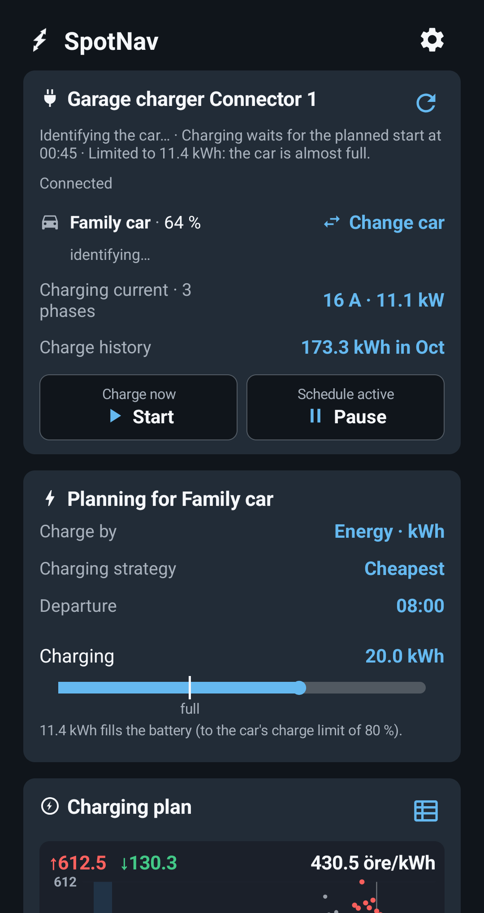
&nbsp;
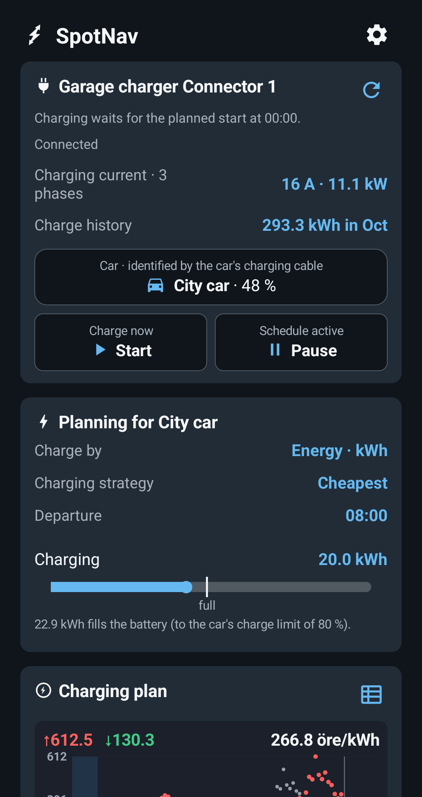

In **Settings → Charger**, the same settings as in the card:

- **Cars at this charger**: the cars that can charge and be planned for here (at least one).
- **Identification**: **Automatic** (from the cars' own reports, asking when they cannot tell), **Always ask**,
  or **Off** (the car you chose stays).
- **Camera**: the camera chosen in Home Assistant, shown here; the camera and its AI task are chosen in the Home
  Assistant card. **Crop parking spot** fetches a picture to drag the selection around the parking spot; only what
  is inside is compared.

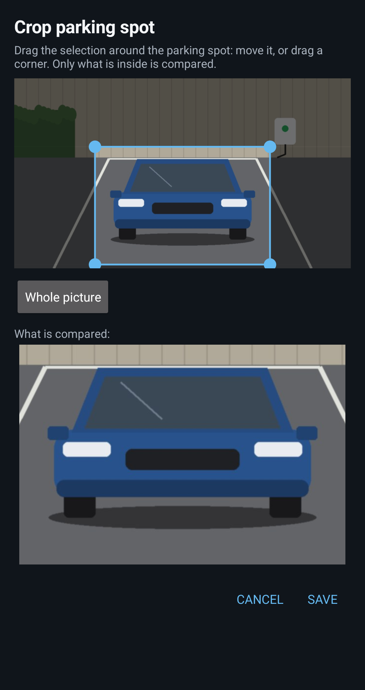

In **Settings → Vehicle**, each car has its **Reference picture**: a **Day** and a **Night** slot. With the car
parked at the charger, **Take day picture** (and, in the dark, **Take night picture** for the camera's infrared);
over a picture the button is **Retake**, and **Delete** removes only that picture. **Close** closes the dialog.
A car without a reference picture is never recognised by the camera.

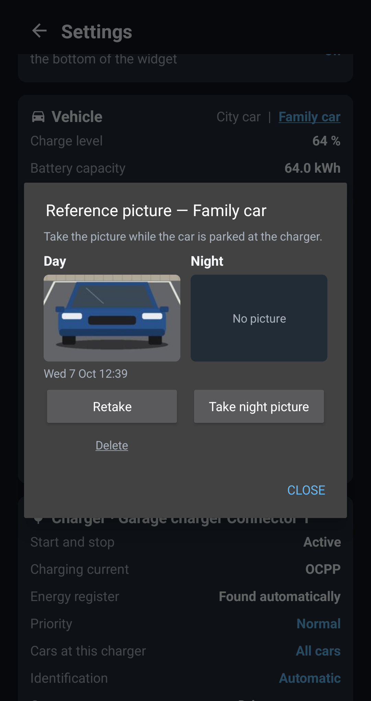

How it decides, what the camera can and cannot tell apart, which AI model to use and what to send with a field
report are in [Which car is plugged in?](https://github.com/henrikekblad/spotnav-home-assistant/blob/main/docs/vehicle-identification.md)
in the Home Assistant integration's documentation.

## Plan chart

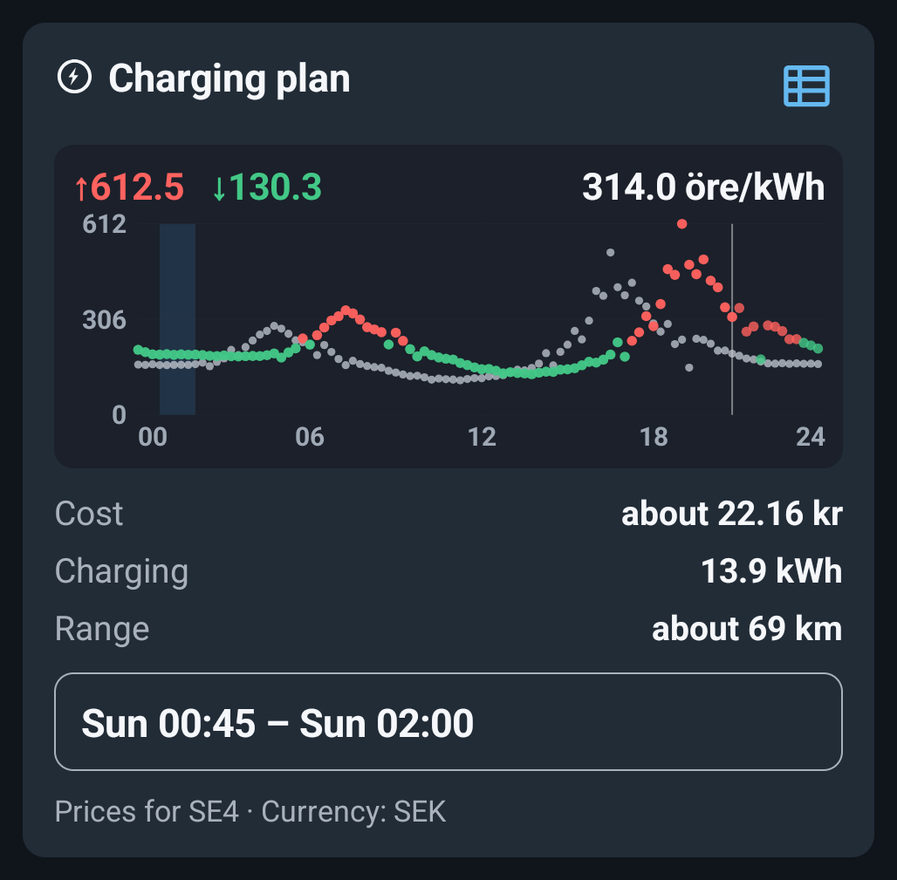

Today's prices and tomorrow's (grey) on one 24-hour axis, green below the day's average and red above
it, with the highest, lowest and current price on top. The shaded band is the planned charging; the line
is now. The table button opens the price table.

## Price table

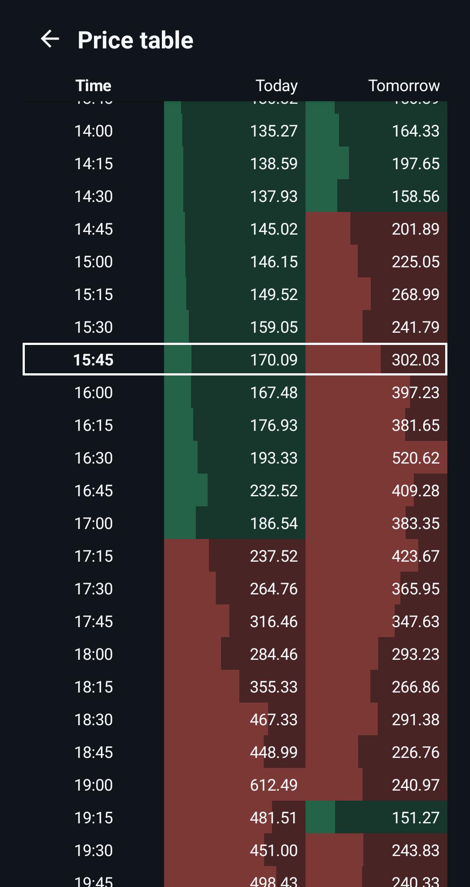

Every quarter-hour (or hour) of today and tomorrow, coloured from cheap to dear, starting at the
current one.

## Home-screen widget

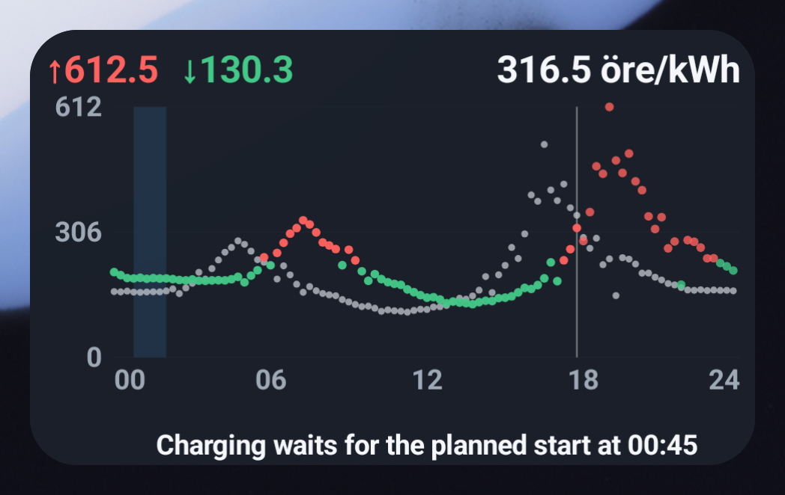

The widget shows the same chart and, when a charger is paired, its status line. Tap it to open the app.
Each widget has its own settings.

## Settings

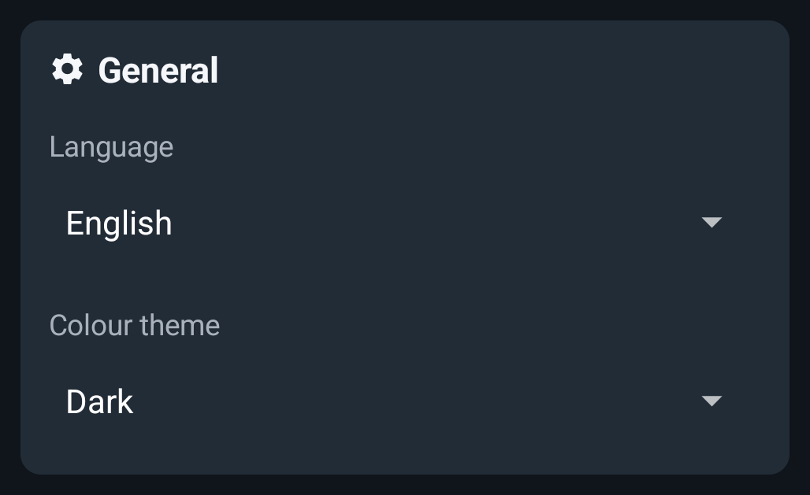

**General**: the app's language and colour theme.

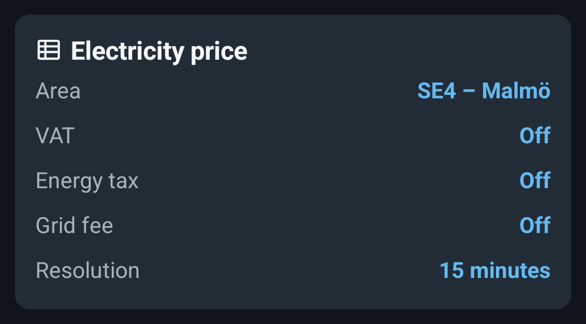

**Electricity price**: 15-minute prices or hourly averages, and the price area and additions. Once
paired, area and taxes are Home Assistant's and are changed through it.

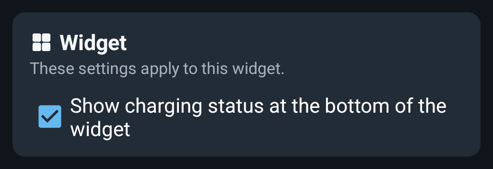

**Widget**: settings of the widget the app was opened from.

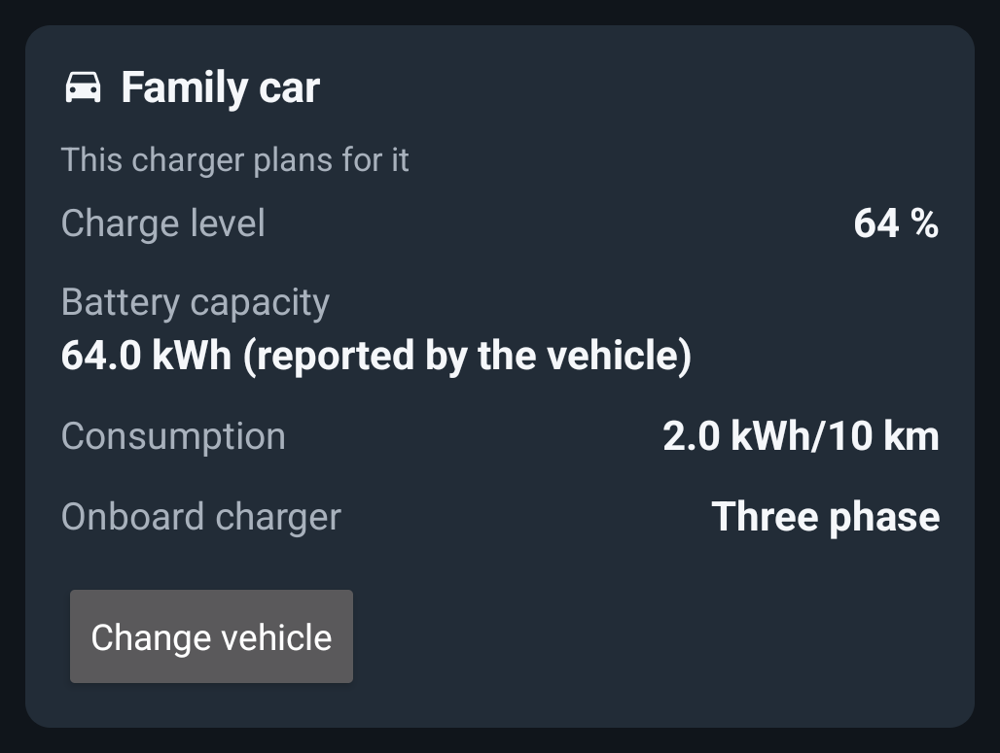

**Vehicle**: the car this charger plans for, and its properties. With two or more cars the card has a tab per car;
each car has its own plug sensor, location and reference picture.

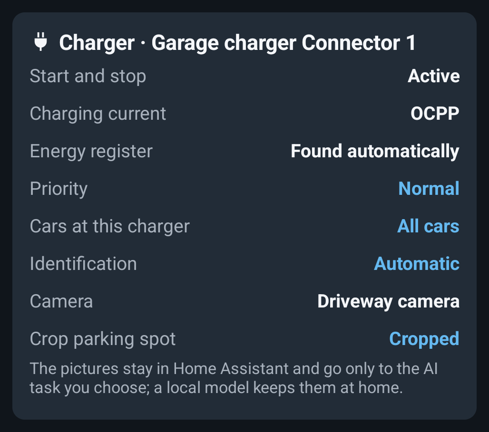

**Charger**: how Home Assistant starts and stops the charger, sets its current and reads its energy, the charger's priority among the site's chargers, and, where several cars can charge, which car is plugged in (see [above](#which-car-is-plugged-in)).

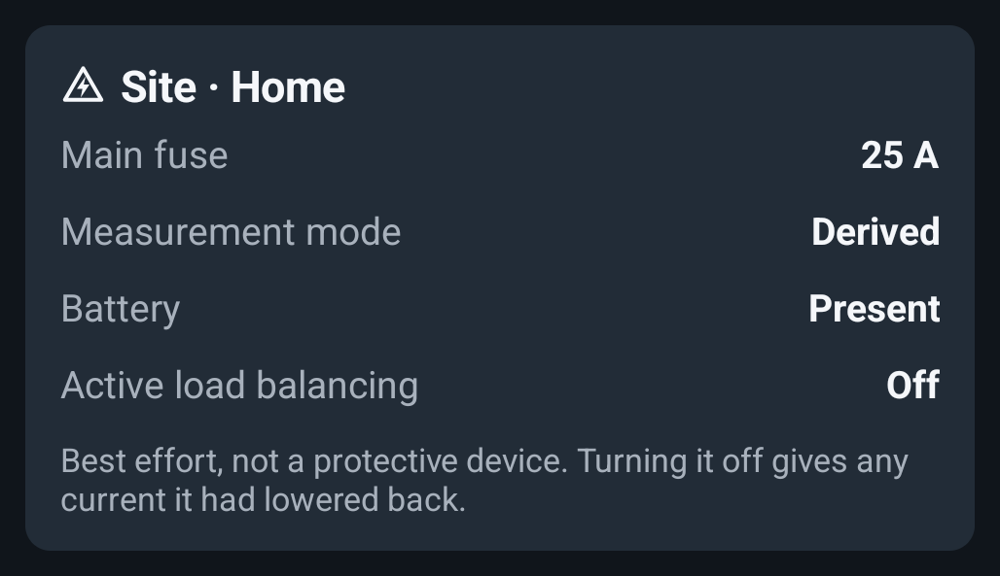

**Site**: the main fuse and how the site's load is measured, and load balancing.

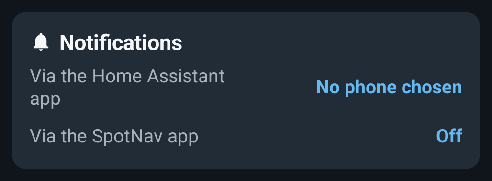

**Notifications**: charging notifications through the Home Assistant companion app, or from this app.

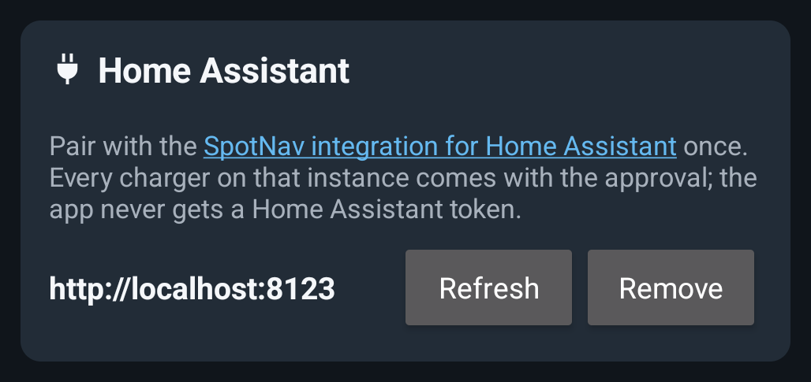

**Home Assistant**: the paired instance, with **Refresh** (ask it again; a charger added there since is offered for pairing) and **Remove**.

## Charge history

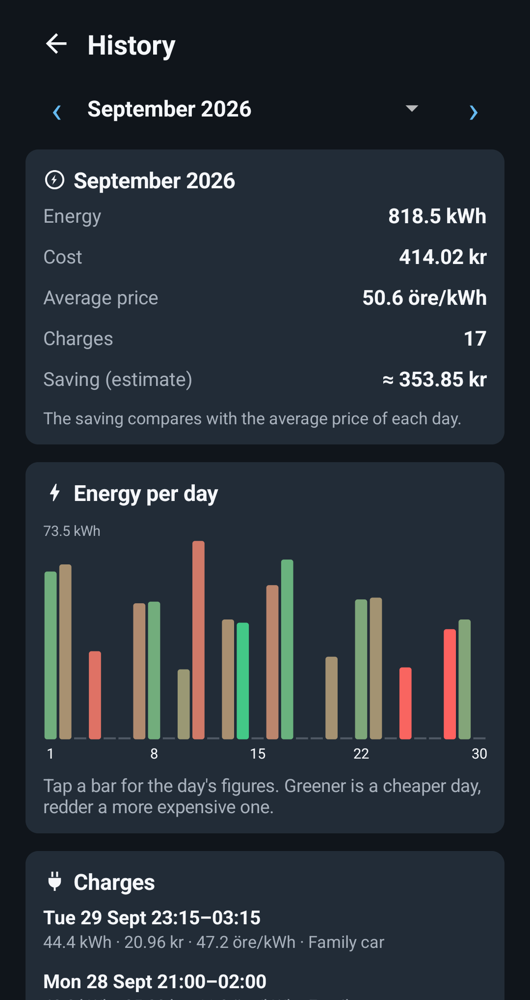

A paired charger's charges month by month: totals, an estimated saving against each day's average
price, a bar per day (greener is cheaper) and every charge with its energy, cost and vehicle. **Export
CSV** shares the month as a file.
